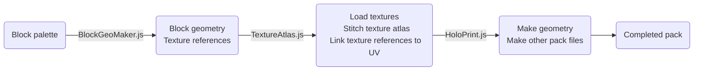

# HoloPrint
## Minecraft Bedrock Build Tool

### About
HoloPrint is a web app that converts MCBE structure files into resource packs showing holograms of builds. It builds off the work of [Structura](https://github.com/RavinMaddHatter/Structura), a similar project. Both Structura and HoloPrint aim to recreate the experience of Java Edition mods like [Litematica](https://github.com/maruohon/litematica) and [Schematica](https://github.com/Lunatrius/Schematica) for Bedrock Edition users through resource packs.

### Usage
> [!NOTE]
> Some platforms hide the Structure Block export button; please use [this pack](https://github.com/bud-aj29/BE_Structure_Export_Import_Show/releases/download/release_v0.0.1/Structure_Export_Import_Show_v0.0.1.Resource.mcpack) by [bud-aj29](https://github.com/bud-aj29) to add it back.
1. Use a Structure Block to export a `.mcstructure` file. To get a structure block, run the command `/give @s structure_block`.
2. Go to [https://superllama88888.github.io/holoprint](https://superllama88888.github.io/holoprint), select your `.mstructure` file, and tweak settings.
3. Generate and download your resource pack (`.mcpack`).
4. Apply your resource pack and place an armour stand in your world.

#### Player controls
- Toggle rendering: Stone  

- Change transparency: Glass (sneak to decrease, stand to increase)  

- Change layer: Planks (sneak to decrease, stand to increase), or changing the pose on the armor stand  

- Move hologram (third person only): Stick  

- Block validation: Iron ingot

https://github.com/user-attachments/assets/8c6a25db-9637-454f-97d7-f324e78580e8

---

### Credit
- [Structura](https://github.com/RavinMaddHatter/Structura): Inspiration, laying the foundation for this project. Without the work of [RavinMaddHatter](https://github.com/RavinMaddHatter) and [others](https://github.com/RavinMaddHatter/Structura/graphs/contributors), this project would've taken tens of hours more to get started.
- [Tab Key Playerlist UI](https://github.com/YuuhaLand/Tabkey_Playerlist_UI) by [YuuhaLand](https://github.com/YuuhaLand): Foundation for the material list UI
- Documentation:
  - [Bedrock Wiki](https://wiki.bedrock.dev): Best resource for learning about resource/behaviour packs!
  - [Minecraft Wiki](https://minecraft.wiki): Block entity list, block states and data values, and so much more!
  - [Bedrock `.mcstructure`. files](https://gist.github.com/tryashtar/87ad9654305e5df686acab05cc4b6205): Explanation of the NBT structure of structure files, by [tryashtar](https://github.com/tryashtar)
  - [Magic Method Docs](https://github.com/BedrockPlus/MagicMethodDocs): Documentation of [Chainsketch](https://www.youtube.com/@Chainsketch)'s technique to pass data between entities in resource packs, written by [White](https://github.com/WhiteOnGitHub) and [chyves](https://github.com/notchyves)
  - [Microsoft BE reference docs](https://learn.microsoft.com/en-us/minecraft/creator/reference): Official schemas for addons/resource packs
- JavaScript libraries:
  - [NBTify](https://github.com/Offroaders123/NBTify): Minecraft NBT reader
  - [tga.js](https://github.com/vthibault/tga.js): TGA to PNG image conversion
  - [potpack](https://github.com/mapbox/potpack): Texture atlas packing
  - [JSZip](https://github.com/Stuk/jszip): Pack zipping
  - [bridge-model-viewer](https://github.com/bridge-core/model-viewer) and [three.js](https://github.com/mrdoob/three.js): Preview rendering
  - [strip-json-comments](https://github.com/sindresorhus/strip-json-comments): Removes comments from JSON files

### Code outline

### Code guidelines
- Ensure code formatting and styling follows everything else.
- All code is to be in American English; other English dialects can be used in comments, commit messages etc.
- Add comments around ambiguous areas of code.
- Use snake_case for data (i.e. Minecraft JSON, our JSON) and camelCase for everything else.
- Console output is mirrored to the user. Each console function should be used in different contexts:
  - `console.log()` is purely for testing. Logs from this will not be shown to the user.
  - `console.debug()` is for when HoloPrint handles an edge case (e.g. loading a TGA texture) and our hardcoded patches (private static fields in classes). This is to help debugging so we are't surprised if it does something out of the ordinary. This is hidden to users by default.
  - `console.info()` is for status about what HoloPrint is currently doing. E.g. Finished making the texture atlas, making geometry, etc. This should only be around the larger steps of the process, and are the main type of output to users.
  - `console.warn()` is for non-critical warnings, such as not finding something in data, or having too much data. Generally, it is reserved for inconsistencies that we get from  Minecraft's data (e.g. texture key from blocks.json not being in terrain_texture.json, serialisation key not existing), although it can be used for general alerts to the user. All warnings should handle everything as best as they can and also say what they're defaulting to.
  - `console.error()` is for errors within our code or data, including block shapes not having any geometry defined, formatting a block state conditional incorrectly, as well as network errors. Again, they should handle everything as best as possible, but they are more critical than warnings. `throw new Error();` should never be used, as this will terminate the program flow.
- `for(... of ...)` loops should be used only for iterables that don't have the `.forEach()` method, or in async functions when everything must happen in order. Use `.forEach()` instead.

### To-Do, planned features
- Putting the pack creator inside an addon and creating it inside the addon? But saving the file won't work... unless we use @minecraft/server-net to upload it to a server but that's only BDS (I think)
  - Since HoloPrint is made in JavaScript it'd mostly be portable inside an addon, but web APIs would need replacements with other libraries. I also hope we can access vanilla textures in addons.
  - I haven't looked at the capabilities of the Scripting API with the Editor but if we could put it in there, it would be even better!
  - The docs mention the "experimental_custom_ui" capability in manifest.json that apparently allows HTML to make UIs - I'm thinking it's OreUI but I haven't seen anyone talk about it so I assume it must nonfunctional. If anyone knows anything about this please reach out.
  - If Jigarbov Production's special "registry" between addons is made publicly available, it could allow another addon on the target world to load the data and somehow render the ghost blocks? IDK how we'd render it then because currently the hologram is hard-baked into the geometry file, and IDK if using hundreds/thousands of entities each rendering a single block would be performant.
  - Even if this registry is also accessible in resource packs, constructing the geometry on the fly would be hard.
- Changing armour stand item to show different models
- Hologram tint overlay toggleable
- Item frame/something other than armour stand??? Item frame is impossible in a resource pack alone, other entities would be possible but they would move. Tamed wolves perhaps?
- Using block models from JE?
  - This would require Bedrock-Java mappings, I think Amulet's super-format could be used. The Amulet format is a universal format for all MC versions in both editions in the last 10 years so would work well.
    - Again, the problem with autogeneration of block geometries is that different textures from resource packs and custom blocks from addons would still need to be done the classic way - how we're doing it currently.
    - Also, due to it being a webpage we want to really minimise performance. We don't want to crash peoples' phones when they try to generate a pack. I fear that using these existing, big-data, high-level solutions could make it less accessible to some players.
    - Note that in Java Edition, block model geometries are available in resource packs already.
      - I've been using these geometries as a guide, and I think if we can achieve what we need just with this repo it will be faster than relying on other projects (which would be unspecialised)...
- Full auto-generation of block geometries (including UVs) all within Bedrock Edition???
  - Use the scripting API to generate all blocks in the world with all states - much like the Java Edition debug world
    - Problem: Fences, glass panes, iron bars, and stairs don't rely on block states for their visual appearance, so it'll have to place blocks around them then
  - Using the structure block .glb export mode only on Windows 10, we export all the blocks into JSON (glb can be turned easily into gltf which is json)
  - Then, when a structure file is uploaded, it looks up the block geometry from the previous step.
  - Many features of HoloPrint such as block scaling, adding the outlines, creating a minified texture atlas, armour stand + player controls etc. would still be needed.
  - Support for resource packs and custom blocks from addons would have to be done in a different way.
  - Could this be done in GitHub Actions on a Windows machine???
    - The two biggest problems are getting Minecraft on a GH Actions machine and interacting with the client without a screen.
    - Looking at the (awful) protocol docs for the [`StructureTemplateDataResponsePacket`](https://mojang.github.io/bedrock-protocol-docs/html/StructureTemplateDataResponsePacket.html) seems like only the structure NBT is transmitted, not the .glb.
    - This is done entirely on the client, which would be harder to simulate in GitHub Actions. Perhaps something fun with Amethyst?
    - Further investigation (i.e. decompilation, static analysis) would be required if we wanted to go down this path, but I think it'd be the most rewarding solution in the long run.
    - Looks like it's a class MinecraftglTFExporter stored in D:\a\_work\1\s\handheld\src-client\common\3DExport\MinecraftglTFExporter.cpp

### About addons
- Behaviour packs would open so many possibilities for HoloPrint packs, but would also be inaccessible to people without access to the server's settings. I don't know much about behaviour packs but I'm guessing it would be quite powerful. Here's what I think we could do:
  - Item frame as the base entity? Not possible in resource packs, and if we're using a behaviour pack we might as well provide an easier way to show holograms than using item frames.
  - Cycling through layers with UI? Impossible in a resource pack
  - Pick-blocking ghost blocks: Maybe in an addon? We'll need to be able to detec middle clicks, do a raycast, then change what the player's holding.
- Regarding a generalised behaviour pack that interacts with generated resource packs: Pretty sure this would be possible. The server would just have to tell the armour stand to do something, but I don't have any experience with behaviour packs.

### Useful documents
- Java block models: https://github.com/InventivetalentDev/minecraft-assets/blob/1.21.1/assets/minecraft/models/block/_all.json
- https://raw.githubusercontent.com/Amulet-Team/Minecraft-Data/main/platforms/bedrock/versions/1.21.3.01/generated/block/block_palette.json (like the official block states but with a version number at the top.)
- https://github.com/Amulet-Team/Minecraft-Data/blob/main/platforms/bedrock/generators/BedrockData/BedrockData/generators/block.cpp
- https://github.com/LiteLDev/LeviLamina/blob/107e58517dd5e56592a476b112dcd2c524b1f26b/src/mc/world/level/block/Block.h#L346
- og block shapes from old resource pack (original version of Mad Hatter's block_definition.json): https://github.com/gentlegiantJGC/Minecraft-Model-Reader/blob/master/minecraft_model_reader/api/resource_pack/bedrock/blockshapes.json
- Resource pack as a replacement for the patches in TextureAtlas? https://github.com/gentlegiantJGC/Minecraft-Model-Reader/blob/master/minecraft_model_reader/api/resource_pack/bedrock/bedrock_vanilla_fix/blocks.json
- structura web/structura block: https://github.com/structuraBlock/structuraBlock.github.io (https://str.cxblog.fun/)
  - this project uses "pyscript" to run Python in the browser with WASM. It is laggy though, took 14.6s to load first for me and roughly 30s to generate the village pack (~22k blocks) and it takes 400-500mb of ram. this takes 1-2 seconds and and ~140mb ram (yes I want to optimise that)
- https://github.com/mrpatches123/patchy-api
- https://github.com/CrowdingFaun624/BedrockDataMiner/tree/main
- Slightly outdated block states list: https://learn.microsoft.com/en-us/minecraft/creator/reference/content/blockreference/examples/intrinsicblockstateslist?view=minecraft-bedrock-experimental
- Block palette dumper addon: https://github.com/Alemiz112/BedrockUtils/tree/master
  - run the addon in BDS with a local server to get a file of all the blocks and their possible states. really useful
- Structure of decompiled functions/classes in MCBE: https://github.com/bricktea/MCStructure
- All in-game block shapes: https://wiki.mcbe-dev.net/p/%E6%96%B9%E5%9D%97/BlockShape

### Block entity data needed
- Banner: rendering texture
- Bed: colour
- Campfire/soul campfire: items being cooked
- Cauldron: water colour, potion content
- Chest: double chests, inventory
- Crafter: inventory
- Decorated pot: sherd faces
- Dispenser/dropper: inventory
- Enchantment table: book rotation?!?!?!
- Flower pot: block inside the pot
- Furnace: inventory
- Hopper: inventory
- Item frame: item inside, rotation
- Jukebox: inventory (disc inside)
- Lectern: showing book or not
- Mob spawner: mob inside
- Moving block: none? this is a wacky one
- Nether reactor: active or not (documentation on this is poor)
- Piston: pushing progress?????? I reckon if it's currently pushing/pulling we make it finish to avoid confusion
- Shulker box: facing direction, inventory
- Sign/hanging sign: text
- Skull: skull type, rotation for when on floor
