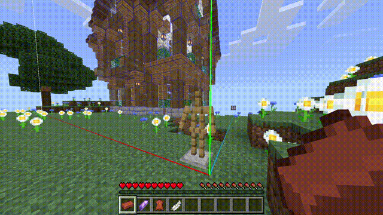

### About
HoloPrint is a web app that converts MCBE structure files into resource packs showing holograms of builds. It builds off the work of [Structura](https://github.com/RavinMaddHatter/Structura), a similar project. Both Structura and HoloPrint aim to recreate the experience of Java Edition mods like [Litematica](https://github.com/maruohon/litematica) and [Schematica](https://github.com/Lunatrius/Schematica) for Bedrock Edition users through resource packs.

> [!TIP]
> View the [wiki](https://holoprint-mc.github.io/wiki) for more detailed instructions!

### Usage
> [!NOTE]
> On Android the Structure Block export button is hidden; please use [this pack](assets/structureBlockButtonAdderPack.mcpack) to add it back.
1. Use a Structure Block to export a `.mcstructure` file. To get a structure block, run the command `/give @s structure_block`.  
  

2. Go to [https://holoprint-mc.github.io](https://holoprint-mc.github.io), select your `.mcstructure` file, and tweak settings.  

3. Generate and download your resource pack (`.mcpack`).  

4. Apply your resource pack and place an armour stand in your world.  

### Hologram controls ([Wiki](https://holoprint-mc.github.io/wiki/hologram-controls))
- Toggle rendering: Brick  

- Change transparency: Amethyst shard (sneak to decrease, stand to increase)  

- Change layer: Leather (sneak to decrease, stand to increase), or changing the pose on the armour stand  

- Move hologram: Stick  

- Rotate hologram: Copper ingot  

- Block validation: Iron ingot  

- Material list: Tab button (keyboard), book icon (touch)  

- Toggle tint: White dye  

- Change layer mode: Flint  

- Change structure: Arrow, or hit armour stand that's holding nothing  

- Save hologram settings: Paper  

- Armour stand controls: Give item or hit  

- Disable player controls: Bone  

> [!WARNING]
> Player controls may be unreliable, but armour stand controls will always work.

Special thanks to **kizoku246** for the house in these images!

---

### Credit
- [Structura](https://github.com/RavinMaddHatter/Structura): Inspiration, laying the foundation for this project. Without the work of [RavinMaddHatter](https://github.com/RavinMaddHatter) and [others](https://github.com/RavinMaddHatter/Structura/graphs/contributors), this project would've taken tens of hours more to get started.
- [Tab Key Playerlist UI](https://github.com/YuuhaLand/Tabkey_Playerlist_UI) by [YuuhaLand](https://github.com/YuuhaLand): Foundation for the material list UI
- [Indyfficient](https://www.youtube.com/@Indyfficient): The idea of changing structure by hitting the armour stand
- [Prowl8413](https://www.youtube.com/@Prowl8413): General feedback during development
- Documentation:
  - [Bedrock Wiki](https://wiki.bedrock.dev): Best resource for learning about resource/behaviour packs!
  - [Minecraft Wiki](https://minecraft.wiki): Block entity list, block states and data values, and so much more!
  - [Bedrock `.mcstructure`. files](https://gist.github.com/tryashtar/87ad9654305e5df686acab05cc4b6205): Explanation of the NBT structure of structure files, by [tryashtar](https://github.com/tryashtar)
  - [Magic Method Docs](https://github.com/BedrockPlus/MagicMethodDocs): Documentation of [Chainsketch](https://www.youtube.com/@Chainsketch)'s technique to pass data between entities in resource packs, written by [White](https://github.com/WhiteOnGitHub) and [chyves](https://github.com/notchyves)
  - [Microsoft BE reference docs](https://learn.microsoft.com/en-us/minecraft/creator/reference): Official schemas for addons/resource packs
- JavaScript libraries:
  - [NBTify](https://github.com/Offroaders123/NBTify): Minecraft NBT reader
  - [tga.js](https://github.com/vthibault/tga.js): TGA to PNG image conversion
  - [potpack](https://github.com/mapbox/potpack): Texture atlas packing
  - [JSZip](https://github.com/Stuk/jszip): Pack zipping
  - [bridge-model-viewer](https://github.com/bridge-core/model-viewer) and [three.js](https://github.com/mrdoob/three.js): Preview rendering
  - [strip-json-comments](https://github.com/sindresorhus/strip-json-comments): Removes comments from JSON files
  - [deepmerge](https://github.com/TehShrike/deepmerge): Merges JSON files