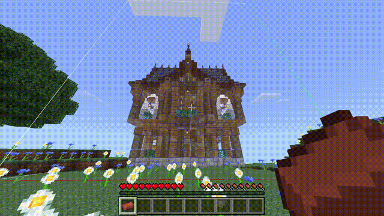
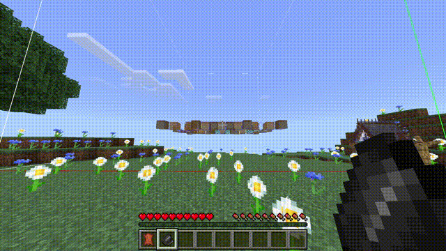

### 关于
全息打印 (HoloPrint) 是一款网页应用，可将我的世界基岩版 (MCBE) 的结构文件（`.mcstructure`）转换为显示建筑全息影像 (也称之为投影) 的资源包。本项目基于 [Structura](https://github.com/RavinMaddHatter/Structura)（一个类似项目）开发，旨在为基岩版玩家提供类似 Java 版模组 [Litematica](https://github.com/maruohon/litematica) 和 [Schematica](https://github.com/Lunatrius/Schematica) 的全息建造体验。

> [!TIP]
> 查看[使用文档](https://holoprint-mc.github.io/wiki/zh-cn)获取详细操作指南！

### 使用方法
> [!NOTE]
> 安卓设备的结构方块导出按钮默认隐藏，请使用 [此资源包](assets/structureBlockButtonAdderPack.mcpack) 恢复按钮。
1. 输入命令 `/give @s structure_block` 获取结构方块，然后使用结构方块导出 `.mcstructure` 文件。
  

2. 访问 <https://holoprint-mc.github.io>，上传结构文件并调整设置。  

3. 下载生成的资源包（`.mcpack`），在游戏中导入后启用。  

4. 在你的世界中放置盔甲架以显示全息影像。  

### 控制全息影像（[Wiki](https://holoprint-mc.github.io/wiki/zh-cn/hologram-controls))
- **切换渲染**：砖块  

- **调整透明度**：紫水晶碎片（潜行降低，反之提高）  

- **切换图层**：皮革(潜行下降，反之上升)，或修改盔甲架姿势  

- **移动影像**：木棍  

- **旋转影像**：铜锭  

- **结构验证**：铁锭  

- **材料清单**： Tab 键（键盘）或书箱图标（触屏）  

- **切换着色**：白色染料  

- **切换图层模式**：燧石  

- **切换结构**：箭矢，或空手攻击盔甲架  

- **保存全息影像设置**：纸  

- **盔甲架控制**：装备物品或攻击  

- **禁用玩家控制**：骨头  

> [!WARNING]
> 玩家控制可能不稳定，但盔甲架控制始终有效。

特别感谢 **kizoku246** 提供演示图中的房屋！

---

### 致谢
- [Structura](https://github.com/RavinMaddHatter/Structura)：灵感来源与项目基础，特别感谢 [RavinMaddHatter](https://github.com/RavinMaddHatter) 以及 [其他贡献者](https://github.com/RavinMaddHatter/Structura/graphs/contributors)。
- [Tab键玩家列表UI](https://github.com/YuuhaLand/Tabkey_Playerlist_UI)：材料清单 UI 的底层实现。（作者 [YuuhaLand](https://github.com/YuuhaLand)）
- [Indyfficient](https://www.youtube.com/@Indyfficient)：通过攻击盔甲架切换结构的创意。
- [Prowl8413](https://www.youtube.com/@Prowl8413)：开发过程中的反馈支持。
- **参考文档：**
  - [基岩版 Wiki](https://wiki.bedrock.dev)：学习资源包/行为包的最佳指南！
  - [Minecraft Wiki](https://minecraft.wiki)：方块实体列表、状态数据等全面资料。
  - [基岩版 `.mcstructure` 文件解析](https://gist.github.com/tryashtar/87ad9654305e5df686acab05cc4b6205)：结构文件的NBT结构说明。（作者 [Tryashtar](https://github.com/tryashtar)）
  - [Magic Method 文档](https://github.com/BedrockPlus/MagicMethodDocs)：原作者 [Chainsketch](https://www.youtube.com/@Chainsketch) 在资源包中的实体之间传递数据的技术文档 (编写者 [White](https://github.com/WhiteOnGitHub) 与 [chyves](https://github.com/notchyves)）
  - [微软官方文档](https://learn.microsoft.com/en-us/minecraft/creator/reference)：附加包/资源包的官方规范。
- **JavaScript库：**
  - [NBTify](https://github.com/Offroaders123/NBTify): Minecraft NBT 解析。
  - [tga.js](https://github.com/vthibault/tga.js): TGA 到 PNG 的图片转换。
  - [potpack](https://github.com/mapbox/potpack)：纹理图集打包。
  - [JSZip](https://github.com/Stuk/jszip)：压缩打包。
  - [bridge-model-viewer](https://github.com/bridge-core/model-viewer) 与 [three.js](https://github.com/mrdoob/three.js)：3D 预览渲染。
  - [strip-json-comments](https://github.com/sindresorhus/strip-json-comments)：JSON 注释清理。
  - [deepmerge](https://github.com/TehShrike/deepmerge)：JSON 合并工具。