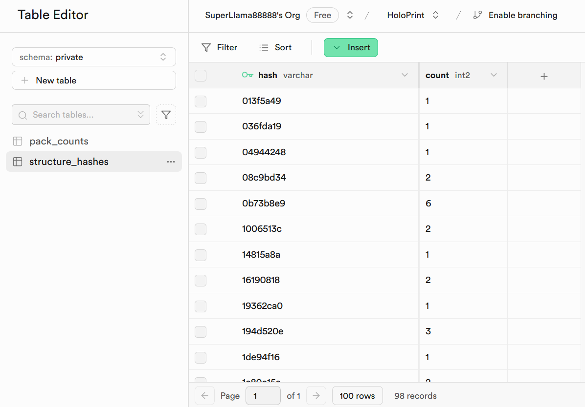

# HoloPrint Terms of Use
Thanks for using HoloPrint! Please read the following Terms of Use. They are effective as of November 17, 2024.

## 1. Created packs
All packs created are licensed under the [CC BY-NC-SA 4.0](https://creativecommons.org/licenses/by-nc-sa/4.0/deed.en) license. In short, you're not allowed to sell packs created using HoloPrint, or put them behind ads. These restrictions only apply to created packs directly.

Some examples of what is and isn't allowed:
- ✅ Writing a blog post tutorial explaining how to use HoloPrint
- ✅ Showing packs created with HoloPrint in a YouTube video
- ❌ Limiting access to packs created with HoloPrint with monetised link shorteners like Linkvertise
- ❌ Forcing people to either wait to download a pack created with HoloPrint or buy a subscription

If you have any questions regarding acceptable use, please feel free to reach out in our [GitHub Discussions](https://github.com/SuperLlama88888/holoprint/discussions).

## 2. Analytics
HoloPrint does **not** record any analytics except for the first 4 bytes of the SHA-256 hashes of structure files used in pack creation. Basically, this is a unique identifier for each file that **cannot** be used to find out the original file. This is used to see how many people are using HoloPrint. Daily statistics are recorded in [the holoprint-stats repository](https://github.com/SuperLlama88888/holoprint-stats), and the code to record structure file usage is in [the `supabase` folder](https://github.com/SuperLlama88888/holoprint/tree/main/supabase).

HoloPrint uses **no** cookies, and the only data stored on your browser is cached resource pack resources, which speeds up pack creation. Resource pack cache can be cleared with the _Resource packs -> Clear resource pack cache_ button.

For transparency, here is all the data stored for analytics:

